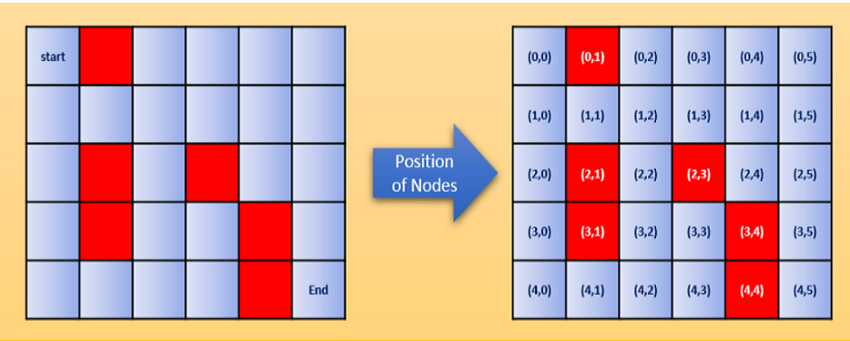
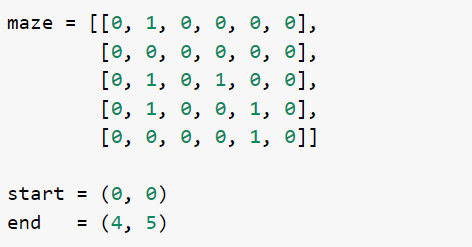
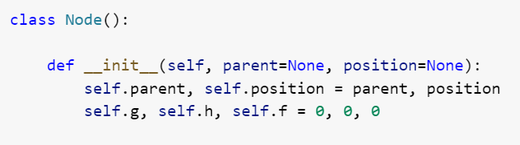
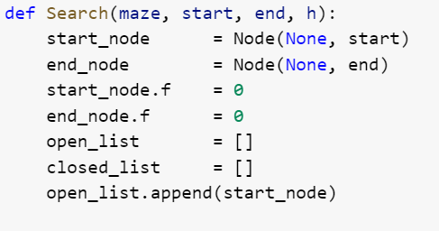
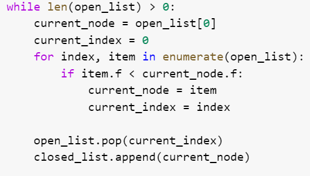
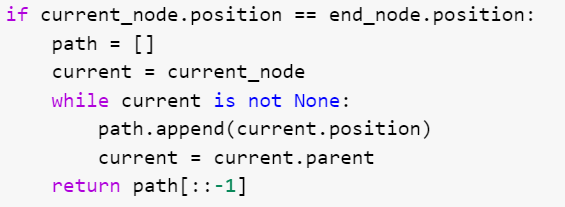
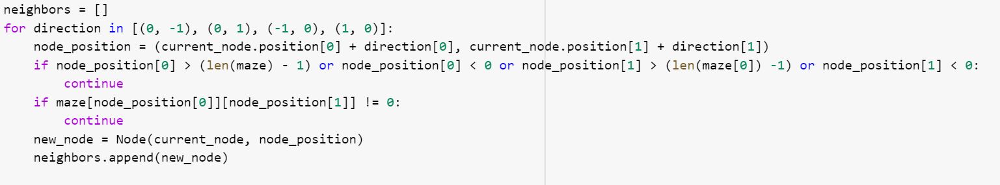
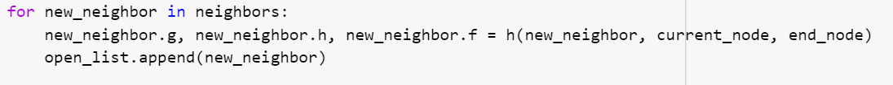
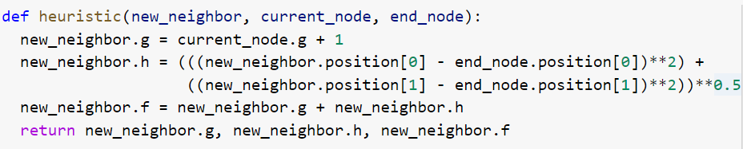
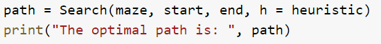

# Heuristic-Search-problem

## Problem Definition

Given the maze in Fig. 1 (5 x 6 nodes), find the shortest path between the starting node (0,0) and the end node (4,5). The permitted moves are four: Left, Right, Up, and Down. The red nodes contain obstacles, and no movements are possible through them. The boundaries are walls, which block movements.

*Fig. 1 The Maze Problem*

## Solution

The solution of this project consists in determining the shortest path from a given starting node A to a given ending node B. This path will be represented with all the nodes visited, including the start and end nodes.

To trace this path, it's necessary to build a specific algorithm, establish acceptable moves, and avoid the obstacles defined initially. In our case, we will use the A* (A-star) algorithm, characterized by the use of a heuristic function to compute the cost function, which will be a distance. The initial heuristic will be the Euclidean distance.

### Introduction to the A* Algorithm

The A* algorithm is a popular search algorithm used for finding the shortest path between two points, often on a grid. It combines the strengths of both uniform-cost search and greedy search algorithms. The algorithm maintains a tree of paths emanating from the starting point, with each path representing a possible candidate for the shortest path to the goal. At each step, the algorithm selects the path with the lowest cost (a combination of the cost of the path so far and an estimate of the cost to reach the goal), which can be either Euclidean or Manhattan, and expands it by adding its neighbors to the tree. The algorithm terminates when the goal is reached or when no more paths can be added. The final path is constructed by backtracking through the tree.

### Defining Scores: h, g, and f

- **h(n)**: An *estimated* distance from node n to the end node.
- **g(n)**: The current shortest distance from the start node to node n.
- **f(n)**: An estimate of the total cost. Calculated as `f(n) = h(n) + g(n)`.

## The Code

We start by defining our 5x6 matrix, named "maze," as a nested list. This matrix contains only two types of elements: "0" for accessible nodes and "1" for obstacles. We also define the start node as (0,0) and the end node as (4,5).

To create a generic code that features all search algorithms and then define the A* algorithm specific to this coursework, we start by creating a class called `Node`. This class contains attributes such as parent, position, and distances (f, g, h), which are initially set to 0.

We define the search function, which requires the maze matrix, start and end nodes, and a heuristic value (h) as inputs, specific to each algorithm (in this case, A*). The first step is to initialize the nodes:

- `start_node` and `end_node` are equal to the start and end nodes.
- `start_node.f` and `end_node.f` are set to 0 as the cost function is null in these nodes.

We also initialize two lists:

- **open_list**: Contains all nodes that the algorithm has to visit.
- **closed_list**: Contains all visited nodes.

After initialization, we insert the start node into the `open_list`.

A while loop is generated that continues until there are no nodes left in the `open_list` (i.e., it runs until the length of `open_list` is greater than 0). The current node is selected by comparing the f cost and choosing the least expensive node.

The current node is removed from the `open_list` and added to the `closed_list` once it has been visited.

If the current node equals the end node, the algorithm backtracks to construct the path, appending each node to the path and reversing it since it was obtained through backtracking.

### Neighbor Nodes and Valid Moves

We define the concept of neighbors and feasible directions:

- (0, -1) to go left
- (0, 1) to go right
- (-1, 0) to move up
- (1, 0) to move down

The current position becomes the parent of the neighbors. A valid neighbor list is created by checking if the location is within maze boundaries and is not an obstacle.

### Functions f, g, and h

We define functions `f`, `g`, and `h` related to the current node.

The specific cost function for the A* algorithm is defined using a suitable heuristic:

- `g(n)`: The distance from the start node to the current node, incremented by 1 for each step.
- `h(n)`: The Euclidean distance between the current node and the end node.

\[ g_n = g_{n-1} + 1 \]

\[ h_n = \sqrt{(x_n - x_{\text{end}})^2 + (y_n - y_{\text{end}})^2} \]

The `f(n)` score is the sum of `g(n)` and `h(n)`.

### Final Path and Results

Given the maze, start node, end node, and heuristic, the searched path is obtained:

The optimal path for our maze is:

## Additional Work

In individual work, other heuristic functions were implemented, and additional algorithms such as Constraint Propagation, Rule-Based, Dijkstra, and Reinforcement Learning were explored to derive the optimal path for the given maze. A 2D representation was also created for visualization.

